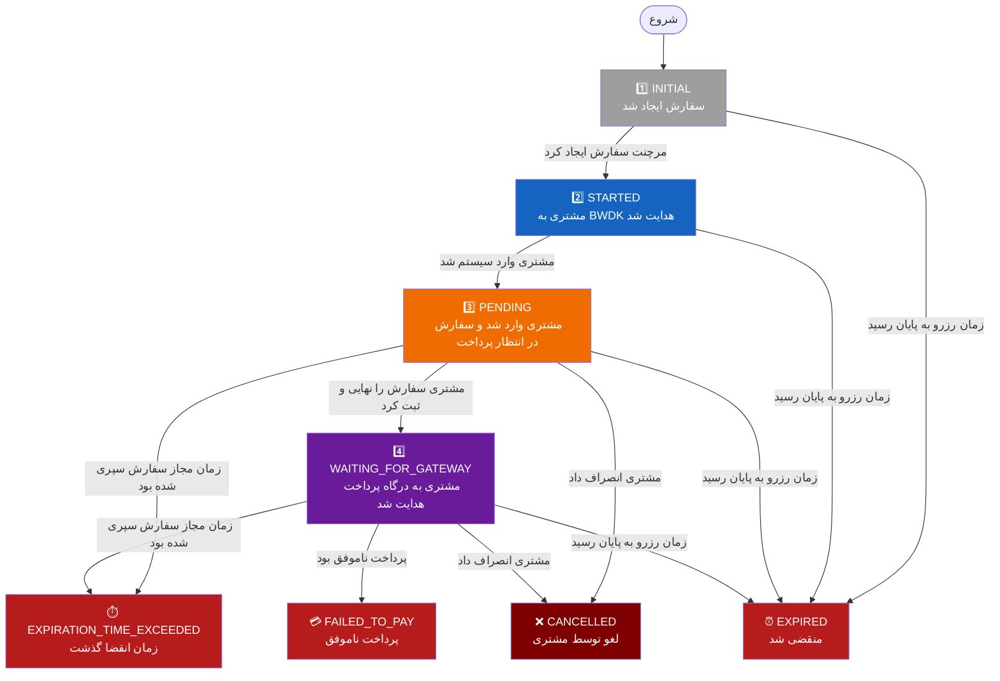
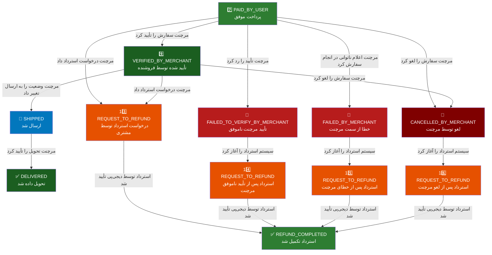

# BWDK Order State Flowchart

This document describes the full lifecycle of an order in the **BWDK (Buy With DigiKala)** platform.
It is intended for merchants integrating with BWDK via any of the generated SDKs.

---

## 1. Pre-payment Flow

The order starts in `INITIAL` and, through customer interaction, progresses toward payment.
At any point before payment, it may also transition into a terminal failure/expiration state.

---

## 2. Post-payment Flow

After a successful payment (`PAID_BY_USER`), the order moves through the merchant
verification, fulfillment, and (optionally) refund pipeline.

---

## توضیح وضعیت‌های سفارش

### ۱. INITIAL — ایجاد اولیه سفارش

**معنا:** سفارش توسط بک‌اند مرچنت ساخته شده ولی هنوز هیچ کاربری به آن اختصاص داده نشده است.

**چگونه اتفاق می‌افتد:** مرچنت با ارسال درخواست `POST /api/v1/orders/create` و ارائه اطلاعات کالاها، مبلغ و `callback_url`، یک سفارش جدید ایجاد می‌کند. BWDK یک `order_uuid` منحصربه‌فرد و لینک شروع سفارش (`order_start_url`) برمی‌گرداند.

**وابستگی‌ها:** نیازی به کاربر یا پرداخت ندارد. فقط اطلاعات کالا از سمت مرچنت کافی است.

---

### ۲. STARTED — آغاز جریان خرید

**معنا:** مشتری روی لینک شروع سفارش کلیک کرده و وارد محیط BWDK شده است، اما هنوز لاگین نکرده.

**چگونه اتفاق می‌افتد:** وقتی مشتری به `order_start_url` هدایت می‌شود، BWDK وضعیت سفارش را از `INITIAL` به `STARTED` تغییر می‌دهد. در این مرحله فرآیند احراز هویت (SSO) آغاز می‌شود.

**وابستگی‌ها:** مشتری باید به لینک شروع هدایت شده باشد.

---

### ۳. PENDING — انتظار برای تکمیل سفارش

**معنا:** مشتری با موفقیت وارد سیستم شده و سفارش به حساب او اختصاص یافته. مشتری در حال انتخاب آدرس، روش ارسال، بسته‌بندی یا تخفیف است.

**چگونه اتفاق می‌افتد:** پس از تکمیل ورود به سیستم (SSO)، BWDK سفارش را به کاربر وصل کرده و وضعیت را به `PENDING` تغییر می‌دهد.

**وابستگی‌ها:** ورود موفق کاربر به سیستم (SSO). در این مرحله مشتری می‌تواند آدرس، شیپینگ، پکینگ و تخفیف را انتخاب کند.

---

### ۴. WAITING_FOR_GATEWAY — انتظار برای پرداخت

**معنا:** مشتری اطلاعات سفارش را تأیید کرده و به درگاه پرداخت هدایت شده است.

**چگونه اتفاق می‌افتد:** مشتری دکمه «پرداخت» را می‌زند (`POST /api/v1/orders/submit`)، سیستم یک رکورد پرداخت ایجاد می‌کند و کاربر به درگاه Digipay هدایت می‌شود. وضعیت سفارش به `WAITING_FOR_GATEWAY` تغییر می‌کند.

**وابستگی‌ها:** انتخاب آدرس، روش ارسال و بسته‌بندی الزامی است. پرداخت باید ایجاد شده باشد.

---

### ۷. PAID_BY_USER — پرداخت موفق

**معنا:** تراکنش پرداخت با موفقیت انجام شده و وجه از حساب مشتری کسر شده است.

**چگونه اتفاق می‌افتد:** درگاه پرداخت نتیجه موفق را به BWDK اطلاع می‌دهد. سیستم پرداخت را تأیید و وضعیت سفارش را به `PAID_BY_USER` تغییر می‌دهد. در این لحظه مشتری به `callback_url` مرچنت هدایت می‌شود.

**وابستگی‌ها:** تأیید موفق تراکنش از سوی درگاه پرداخت (Digipay).

---

### ۹. VERIFIED_BY_MERCHANT — تأیید توسط مرچنت

**معنا:** مرچنت سفارش را بررسی کرده و موجودی کالا و صحت اطلاعات را تأیید نموده است. سفارش آماده ارسال است.

**چگونه اتفاق می‌افتد:** مرچنت با ارسال درخواست `POST /api/v1/orders/manager/{uuid}/verify` سفارش را تأیید می‌کند. این مرحله **اجباری** است و باید پس از پرداخت موفق انجام شود.

**وابستگی‌ها:** سفارش باید در وضعیت `PAID_BY_USER` باشد. مرچنت باید موجودی کالا را بررسی کند.

---

### ۲۰. SHIPPED — ارسال شد

**معنا:** سفارش از انبار خارج شده و در حال ارسال به مشتری است.

**چگونه اتفاق می‌افتد:** مرچنت پس از ارسال کالا، وضعیت سفارش را از طریق API به `SHIPPED` تغییر می‌دهد.

**وابستگی‌ها:** سفارش باید در وضعیت `VERIFIED_BY_MERCHANT` باشد.

---

### ۱۹. DELIVERED — تحویل داده شد

**معنا:** سفارش به دست مشتری رسیده و فرآیند خرید به پایان رسیده است.

**چگونه اتفاق می‌افتد:** مرچنت پس از تحویل موفق، وضعیت را به `DELIVERED` تغییر می‌دهد.

**وابستگی‌ها:** سفارش باید در وضعیت `SHIPPED` باشد.

---

### ۵. EXPIRED — منقضی شد

**معنا:** زمان رزرو سفارش به پایان رسیده و سفارش به صورت خودکار لغو شده است.

**چگونه اتفاق می‌افتد:** یک Task دوره‌ای به طور خودکار سفارش‌هایی که `reservation_expired_at` آن‌ها گذشته را پیدا کرده و وضعیتشان را به `EXPIRED` تغییر می‌دهد. این مکانیزم مانع بلوکه شدن موجودی کالا می‌شود.

**وابستگی‌ها:** سفارش باید در یکی از وضعیت‌های `INITIAL`، `STARTED`، `PENDING` یا `WAITING_FOR_GATEWAY` باشد و زمان رزرو آن گذشته باشد.

---

### ۱۸. EXPIRATION_TIME_EXCEEDED — زمان انقضا گذشت

**معنا:** در لحظه ثبت نهایی یا پرداخت، مشخص شد که زمان مجاز سفارش تمام شده است.

**چگونه اتفاق می‌افتد:** هنگام ارسال درخواست پرداخت (`submit_order`)، سیستم بررسی می‌کند که `expiration_time` سفارش هنوز معتبر است یا خیر. در صورت گذشتن زمان، وضعیت به `EXPIRATION_TIME_EXCEEDED` تغییر می‌کند.

**وابستگی‌ها:** سفارش در وضعیت `PENDING` یا `WAITING_FOR_GATEWAY` است و فیلد `expiration_time` سپری شده.

---

### ۶. CANCELLED — لغو توسط مشتری

**معنا:** مشتری در حین فرآیند خرید (قبل از پرداخت) سفارش را لغو کرده یا از صفحه خارج شده است.

**چگونه اتفاق می‌افتد:** مشتری در صفحه checkout دکمه «انصراف» را می‌زند یا پرداخت ناموفق بوده و سفارش به حالت لغو درمی‌آید.

**وابستگی‌ها:** سفارش باید در وضعیت `PENDING` یا `WAITING_FOR_GATEWAY` باشد. پرداختی انجام نشده است.

---

### ۸. FAILED_TO_PAY — پرداخت ناموفق

**معنا:** تراکنش پرداخت انجام نشد یا با خطا مواجه شد.

**چگونه اتفاق می‌افتد:** درگاه پرداخت نتیجه ناموفق برمی‌گرداند یا فرآیند بازگشت وجه در مرحله پرداخت با شکست مواجه می‌شود.

**وابستگی‌ها:** سفارش باید در وضعیت `WAITING_FOR_GATEWAY` بوده باشد.

---

### ۱۰. FAILED_TO_VERIFY_BY_MERCHANT — تأیید ناموفق توسط مرچنت

**معنا:** مرچنت سفارش را رد کرده است؛ معمولاً به دلیل ناموجود بودن کالا یا مغایرت اطلاعات.

**چگونه اتفاق می‌افتد:** مرچنت در پاسخ به درخواست verify، خطا برمی‌گرداند یا API آن وضعیت ناموفق تنظیم می‌کند. پس از این وضعیت، فرآیند استرداد وجه آغاز می‌شود.

**وابستگی‌ها:** سفارش باید در وضعیت `PAID_BY_USER` باشد.

---

### ۱۱. FAILED_BY_MERCHANT — خطا از سمت مرچنت

**معنا:** مرچنت پس از تأیید اولیه، اعلام می‌کند که قادر به انجام سفارش نیست (مثلاً به دلیل اتمام موجودی).

**چگونه اتفاق می‌افتد:** مرچنت وضعیت را به `FAILED_BY_MERCHANT` تغییر می‌دهد. وجه پرداختی مشتری مسترد خواهد شد.

**وابستگی‌ها:** سفارش باید در وضعیت `PAID_BY_USER` باشد.

---

### ۱۲. CANCELLED_BY_MERCHANT — لغو توسط مرچنت

**معنا:** مرچنت پس از پرداخت، سفارش را به هر دلیلی لغو کرده است.

**چگونه اتفاق می‌افتد:** مرچنت درخواست لغو سفارش را ارسال می‌کند. وجه پرداختی مشتری به او بازگردانده می‌شود.

**وابستگی‌ها:** سفارش باید در وضعیت `PAID_BY_USER` یا `VERIFIED_BY_MERCHANT` باشد.

---

### ۱۳. REQUEST_TO_REFUND — درخواست استرداد توسط مشتری

**معنا:** مشتری درخواست بازگشت وجه داده و سیستم در حال پردازش استرداد است.

**چگونه اتفاق می‌افتد:** مرچنت از طریق API درخواست استرداد را ثبت می‌کند (`POST /api/v1/orders/manager/{uuid}/refund`). سفارش وارد صف پردازش استرداد می‌شود.

**وابستگی‌ها:** سفارش باید در وضعیت `PAID_BY_USER` یا `VERIFIED_BY_MERCHANT` باشد.

---

### ۱۴، ۱۵، ۱۶. سایر وضعیت‌های درخواست استرداد

این وضعیت‌ها بر اساس دلیل استرداد از هم تفکیک می‌شوند:

- **۱۴ — REQUEST_TO_REFUND_TO_MERCHANT_AFTER_FAILED_TO_VERIFY:** استرداد پس از ناموفق بودن تأیید مرچنت؛ وجه به حساب مرچنت بازمی‌گردد.
- **۱۵ — REQUEST_TO_REFUND_TO_CUSTOMER_AFTER_FAILED_BY_MERCHANT:** استرداد پس از خطای مرچنت؛ وجه به مشتری بازمی‌گردد.
- **۱۶ — REQUEST_TO_REFUND_TO_MERCHANT_AFTER_CANCELLED_BY_MERCHANT:** استرداد پس از لغو توسط مرچنت؛ وجه به حساب مرچنت برمی‌گردد.

**چگونه اتفاق می‌افتد:** به صورت خودکار پس از رسیدن به وضعیت‌های ناموفق/لغو مربوطه توسط سیستم تنظیم می‌شود.

---

### ۱۷. REFUND_COMPLETED — استرداد تکمیل شد

**معنا:** وجه با موفقیت به صاحب آن (مشتری یا مرچنت بسته به نوع استرداد) بازگردانده شده است.

**چگونه اتفاق می‌افتد:** Task پردازش استرداد (`process_order_refund`) پس از تأیید موفق بازگشت وجه از سوی Digipay، وضعیت سفارش را به `REFUND_COMPLETED` تغییر می‌دهد.

**وابستگی‌ها:** یکی از وضعیت‌های درخواست استرداد (۱۳، ۱۴، ۱۵ یا ۱۶) باید فعال باشد و Digipay تراکنش استرداد را تأیید کرده باشد.

